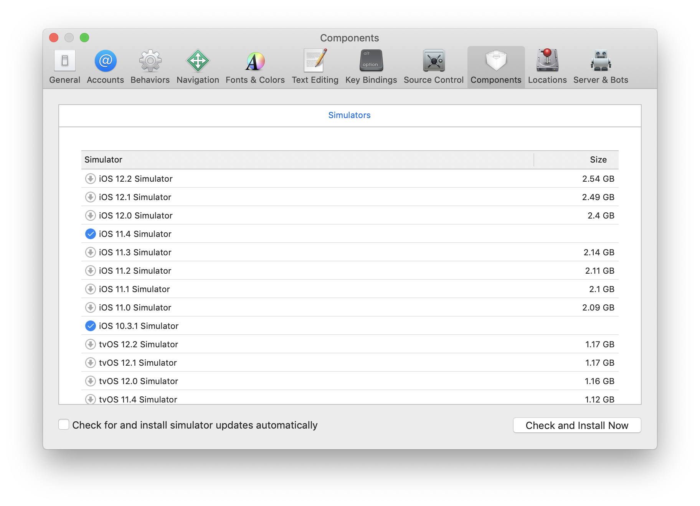

# 测试iOS兼容性

1. 打开iOS模拟器
```bash
    open /Applications/Xcode.app/Contents/Developer/Applications/Simulator.app
```
2. 将模拟器固定到dash栏，方便下次打开。


1. 点击状态栏，`hardware -> device` 开启指定版本iOS。打开Xcode点击设置，如下图，安装指定版本iOS。



1. 在每个大版本iOS系统下，用safari打开页面测试看是否有问题。

***为何需要针对每个iOS版本作兼容测试：[Click here](https://www.safari-is-the-new-ie.com/)！***