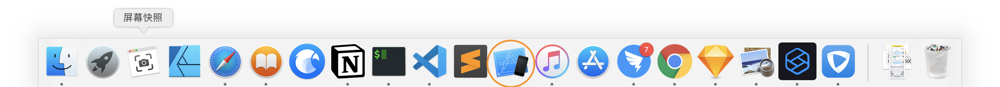
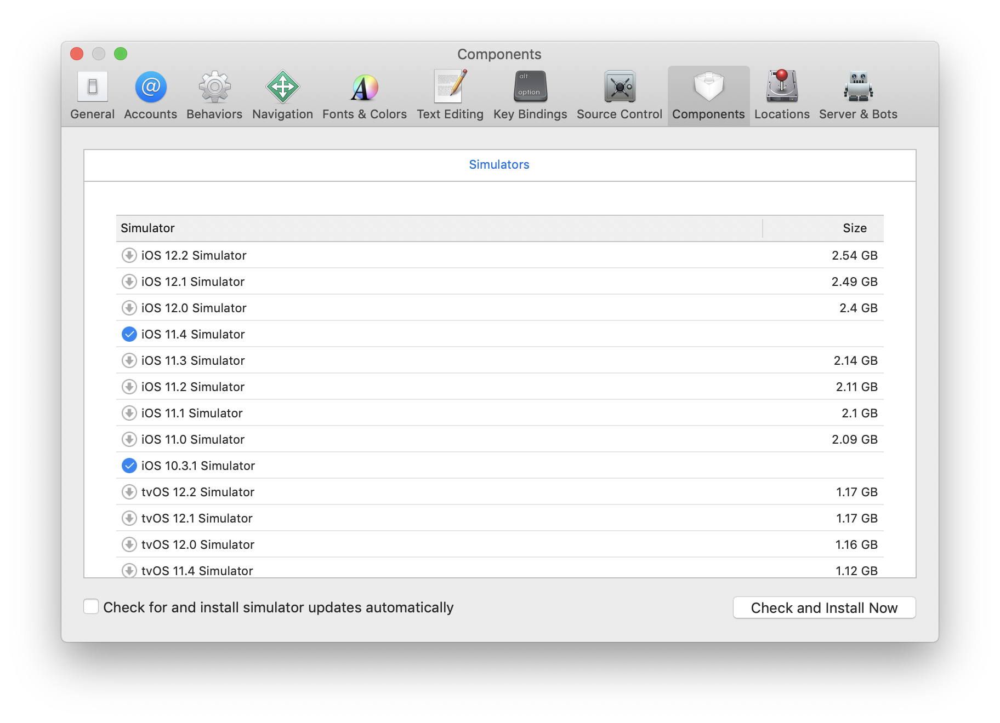

### 1. 打开 iOS 模拟器
```bash
    open /Applications/Xcode.app/Contents/Developer/Applications/Simulator.app
```
### 2. 将模拟器固定到 dash 栏，方便下次打开。



### 3. 下载不同版本的 iOS

1. 点击状态栏，`hardware -> device` 开启指定版本 iOS。打开 Xcode 点击设置，如下图，安装指定版本 iOS。



1. 在每个大版本 iOS 系统下，用 safari 打开页面测试看是否有问题。

***为何需要针对每个 iOS 版本做兼容测试：[Click here](https://www.safari-is-the-new-ie.com/)！***